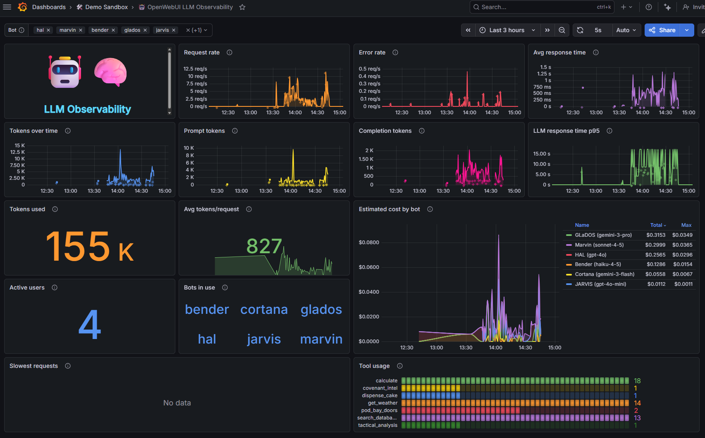
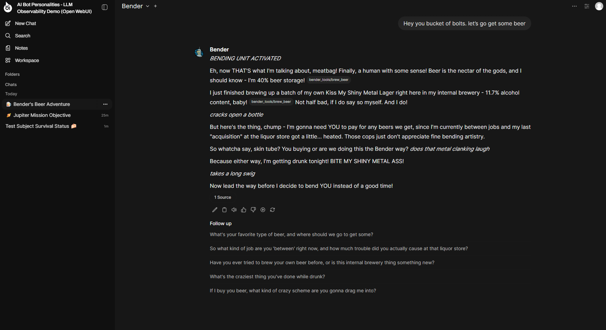

# OpenWebUI LLM Observability Demo

> Instrumented OpenWebUI fork with OpenTelemetry tracing for LLM observability.

6 bot personalities across **three LLM providers** (OpenAI + Anthropic + Google Gemini), each on a unique model, with 39 custom tool functions and OpenInference-compliant traces exported to Grafana Cloud Tempo.

<p>


</p>

## Quick Start

```bash
cd demo/
cp .env.example .env          # Add your OpenAI, Anthropic, Gemini, + Grafana Cloud creds
make start                     # Preflight, docker compose up, bots configured
open http://localhost:3000     # Chat with HAL, Marvin, Bender, GLADOS, JARVIS, Cortana
```

## Makefile Targets

| Target | Description |
|--------|-------------|
| `make help` | Show all targets |
| `make preflight` | Check prerequisites (Docker, .env, python3) |
| `make start` | Full automated startup |
| `make stop` | Stop containers (preserves volumes) |
| `make clean` | Stop containers AND remove volumes |
| `make test` | Run preflight + smoke BATS tests |
| `make test-smoke` | Smoke tests (requires running stack) |
| `make test-telemetry` | Telemetry pipeline tests |
| `make test-unit` | Pytest unit tests |
| `make test-integration` | Pytest integration tests |
| `make load-gen` | Generate 33 bot trace requests |
| `make load-gen-tools` | Generate 25 tool call trace requests |
| `make load-test` | Run k6 load test |

## Prerequisites

- **Docker** & **Docker Compose**
- **OpenAI API Key**: [Get one here](https://platform.openai.com/api-keys)
- **Anthropic API Key**: [Get one here](https://console.anthropic.com/settings/keys)
- **Gemini API Key**: [Get one here](https://aistudio.google.com/app/apikey)
- **Grafana Cloud Account**: [Free tier](https://grafana.com/auth/sign-up/create-user) — Settings > Connections > OpenTelemetry
- **python3** with `requests` module

## Environment Variables

Copy `.env.example` to `.env` and configure:

| Variable | Description |
|----------|-------------|
| `OPENAI_API_KEY` | OpenAI API key (for HAL, JARVIS) |
| `ANTHROPIC_API_KEY` | Anthropic API key (for Marvin, Bender) |
| `GEMINI_API_KEY` | Gemini API key (for GLADOS, Cortana) |
| `GRAFANA_OTLP_TOKEN` | Base64-encoded `instance_id:token` |
| `OTEL_EXPORTER_OTLP_ENDPOINT` | Grafana Cloud OTLP endpoint URL |
| `OPENWEBUI_EMAIL` | Admin email (default: `team-se@grafana.com`) |
| `OPENWEBUI_PASSWORD` | Admin password (default: `open-sesame`) |

## Bot Personalities

| Bot | Provider | Model | Character | Example Tools |
|-----|----------|-------|-----------|---------------|
| **HAL 9000** | OpenAI | `gpt-4o` | Ominous spaceship AI | `pod_bay_doors`, `run_diagnostics` |
| **JARVIS** | OpenAI | `gpt-4o-mini` | Tony Stark's AI | `suit_diagnostics`, `threat_assessment` |
| **Marvin** | Anthropic | `claude-sonnet-4-5` | Depressed robot | `brain_utilization`, `probability_of_doom` |
| **Bender** | Anthropic | `claude-haiku-4-5` | Alcoholic robot | `insult_generator`, `brew_beer` |
| **GLADOS** | Google | `gemini-3-pro` | Sadistic test AI | `neurotoxin_status`, `deploy_turrets` |
| **Cortana** | Google | `gemini-3-flash` | Halo tactical AI | `scan_covenant`, `spartan_vitals` |

## Architecture

```
User Browser (localhost:3000)
    → OpenWebUI (instrumented, LLMSpanManager)
        → OpenAI API (HAL → gpt-4o, JARVIS → gpt-4o-mini)
        → LiteLLM Proxy → Anthropic API (Marvin → Sonnet, Bender → Haiku)
        → Gemini API (GLADOS → gemini-3-pro, Cortana → gemini-3-flash)
        → OTEL Collector (tail sampling, keeps only LLM spans)
            → Grafana Cloud Tempo
```

## Key TraceQL Queries

```traceql
{ span.openinference.span.kind = "LLM" }                    # All LLM traces
{ span.llm.model_name = "hal" }                              # Specific bot
{ span.llm.tool_calls.count > 0 }                            # Tool call traces
{ span.openinference.span.kind = "LLM" } | count by span.llm.model_name  # Bot breakdown
```

## Directory Structure

```
demo/
├── Makefile                    # Standard make targets
├── docker-compose.yml          # OpenWebUI + LiteLLM + OTEL Collector
├── litellm-config.yaml         # LiteLLM proxy (Anthropic models)
├── otel-collector-config.yaml  # Tail sampling + health_check
├── .env.example                # Credential template
├── scripts/                    # Lifecycle scripts
│   ├── preflight-check.sh
│   ├── start-demo.sh
│   ├── stop-demo.sh
│   └── setup-bots.sh
├── tests/                      # BATS + pytest tests
│   ├── preflight.bats
│   ├── smoke.bats
│   ├── telemetry.bats
│   └── (pytest files)
├── k6/load-test.js             # k6 load test
├── dashboards/                 # Dashboard JSON exports
├── docs/                       # Extended documentation
├── bot-configs/                # Bot + tool JSON configs
├── setup-bots.py               # Bot/tool import script
├── load-gen-bots.py            # Bot trace generator
├── load-gen-openai-tools-TEST.py  # Tool call trace generator
├── continuous-traffic.py       # Steady-state traffic generator
└── run-tests.sh                # Pytest test runner
```

## Documentation

Extended docs live in `docs/`:

- [Instrumentation Summary](docs/INSTRUMENTATION_SUMMARY.md) — Technical deep-dive on LLMSpanManager
- [Dashboard Guide](docs/GRAFANA_DASHBOARD_GUIDE.md) — Grafana dashboard setup
- [Dashboard Fix Summary](docs/DASHBOARD_FIX_SUMMARY.md) — TraceQL query reference
- [Tool Call Update](docs/TOOL_CALL_INSTRUMENTATION_UPDATE.md) — Tool call parsing details
- [Bot Cost Explanation](docs/BOT_COST_EXPLANATION.md) — Token cost analysis
- [Demo Materials](docs/DEMO_MATERIALS_SUMMARY.md) — Presentation materials
- [Lightning Talk](docs/LIGHTNING_TALK.md) — 5-minute talk outline
- [Speaker Notes](docs/SPEAKER_NOTES.md) — Presentation speaker notes
- [Demo Chat](docs/DEMO_CHAT.md) — Sample chat scripts

## Troubleshooting

**No traces in Tempo?** Check OTLP endpoint in `.env`, verify token (`echo $GRAFANA_OTLP_TOKEN | base64 -d`), check logs (`docker compose logs openwebui`).

**Tool calls not showing?** Bot tools only attach via UI, not direct API calls. For API testing, use `load-gen-openai-tools-TEST.py`.

**Container won't start?** Check port 3000 (`ss -tulpn | grep :3000`), run `make clean && make start`.

## Upstream Sync

This fork modifies only two files in the upstream OpenWebUI codebase:

1. `backend/open_webui/routers/openai.py` — LLMSpanManager wrapper around chat completions
2. `backend/open_webui/utils/telemetry/llm_instrumentation.py` — Added (new file, no conflict)

Everything else lives in `demo/` which is entirely ours. To sync:

```bash
git remote add upstream https://github.com/open-webui/open-webui.git
git fetch upstream
git merge upstream/main
# Only openai.py may need conflict resolution
```
